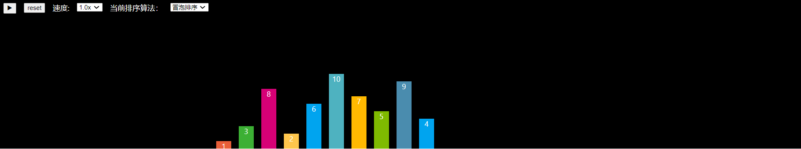

# Getting Started with Create React App

This project was bootstrapped with [Create React App](https://github.com/facebook/create-react-app).

## Available Scripts

In the project directory, you can run:

### `npm start`

Runs the app in the development mode.\
Open [http://localhost:3000](http://localhost:3000) to view it in the browser.

The page will reload if you make edits.\
You will also see any lint errors in the console.

# react-sort-visualization

#### 介绍
react实现一下各种排序算法的可视化

#### 一些截图

#### 参与贡献

1.  Fork 本仓库
2.  新建 Feat_xxx 分支
3.  提交代码
4.  新建 Pull Request

#### 存在的问题

目前只写了几个排序算法：

- 冒泡排序
- 插入排序
- 选择排序
- 希尔排序

由于排序函数中，我使用了function*，所以归并排序和快速排序这两个使用递归实现的算法，我没办法使用yield返回中间结果。但是排序的算法写好了，只是注释掉了，欢迎有能力的大佬帮我解决这个问题😁